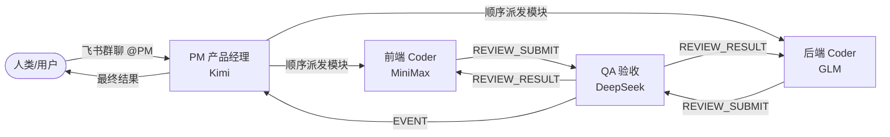
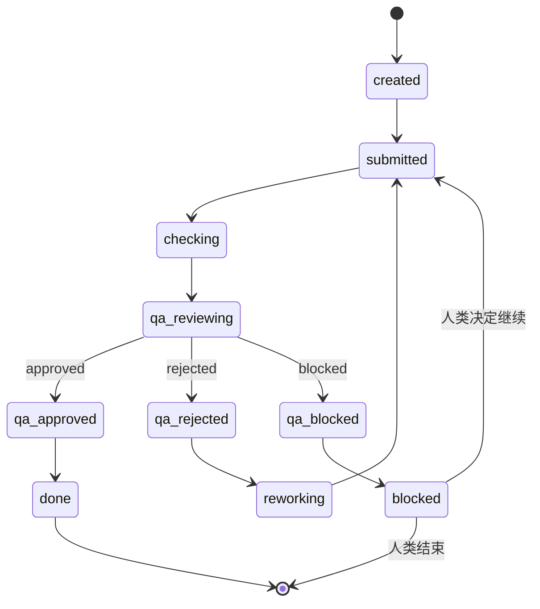

# AgentHub

> 多 Agent 协作开发系统 | PM 编排 · QA 验收 · 人类拍板

AgentHub 是一个面向软件开发的多 Agent 协作框架。它通过**产品经理（PM）编排任务、Coder 实现小模块、QA 验收、人类最终决策**的方式，把复杂的开发需求拆成可顺序交付的小模块，降低大模型代码生成时的截断和返工风险。

---

## 架构概览



### 核心设计

| 设计点 | 说明 |
|---|---|
| **PM 编排** | 接收人类需求，拆分为 2-5 个顺序小模块，逐个派发 |
| **Coder 实现** | 前端/后端 Coder 每次只交付一个可运行的小模块 |
| **QA 验收** | 独立模型验收产出，避免 Coder 自审；只关注功能和可运行性 |
| **人类拍板** | QA 阻塞时通知人类，由人类决定修复/跳过/结束 |
| **顺序交付** | 一个模块验收通过后再进行下一个，降低上下文爆炸 |
| **完全可审计** | 所有任务状态、消息流转、LLM 调用落盘 SQLite |

---

## 角色与模型

| Agent | 角色 | Provider | 模型 | 职责 |
|---|---|---|---|---|
| `pm` | 产品经理 | Kimi | `kimi-for-coding` | 需求拆解、模块编排、人类通知 |
| `coder_fe` | 前端开发 | MiniMax | `MiniMax-M2.7` | 前端小模块实现（单文件 HTML） |
| `coder_be` | 后端开发 | GLM | `glm-5.1` | 后端小模块实现（单文件 FastAPI） |
| `qa` | QA 验收 | DeepSeek | `deepseek-v4-pro` | 功能/代码验收，输出 verdict |

> 模型隔离：QA 与 Coder 使用不同 provider，避免自审失效。

---

## 消息流

```
┌─────────────┐     @PM      ┌─────────────────────────────────────┐
│  人类(飞书)  │ ───────────▶ │                PM                   │
└─────────────┘              │  拆分需求 → 生成 module_1..module_N  │
                             └─────────────────────────────────────┘
                                               │
                                               ▼
                              ┌────────────────────────────────────┐
                              │  for each module:                  │
                              │    PM ──REQUEST──▶ coder_x         │
                              │    coder_x ──REVIEW_SUBMIT──▶ QA   │
                              │    QA ──REVIEW_RESULT──▶ coder_x   │
                              │    QA ──EVENT──▶ PM                │
                              │    approved → 下一个模块            │
                              │    rejected → Coder 自动返工        │
                              │    blocked  → PM 通知人类           │
                              └────────────────────────────────────┘
                                               │
                                               ▼
                              ┌────────────────────────────────────┐
                              │  全部完成后，PM 汇总结果 → 飞书群    │
                              └────────────────────────────────────┘
```

---

## 任务状态机



- `approved`：模块通过，继续下一个
- `rejected`：小问题，Coder 自动返工（最多 3 次）
- `blocked`：严重问题或需要人类决策，PM 暂停并通知人类

---

## 技术栈

- **Python 3.10+**
- **asyncio + EventBus**：基于 `asyncio.Queue` 的进程内消息总线
- **多 Provider LLM Client**：统一封装 OpenAI 风格接口，支持 Kimi / GLM / DeepSeek / MiniMax
- **SQLite**：任务持久化 + 审计日志
- **FastAPI / lark-oapi**：飞书 Webhook / 长连接接入

---

## 快速开始

### 1. 安装依赖

```bash
git clone https://github.com/yourname/AgentHub.git
cd AgentHub
pip install -r requirements.txt
```

### 2. 配置环境变量

```bash
cp .env.example .env
# 编辑 .env 填入：
# - 4 个 LLM provider 的 API key
# - 4 个飞书机器人的 app_id / app_secret
```

### 3. 校验配置

```bash
python config.py
```

### 4. 启动飞书长连接服务（推荐）

```bash
python examples/feishu_ws_server.py
```

保持终端运行。然后在飞书群里 @PM机器人 发送需求即可。

### 5. 本地命令行 Demo

```bash
python examples/demo.py
```

---

## 飞书接入

1. 进入 [飞书开放平台](https://open.feishu.cn/)，创建 4 个机器人应用：PM、QA、前端、后端
2. 在 **PM 机器人** 的事件订阅中选择 **长连接模式**
3. 添加事件：`im.message.receive_v1`
4. 启动 `python examples/feishu_ws_server.py`
5. 在飞书后台点击 **保存**
6. 将 PM 机器人拉入目标群聊，@它发送需求

权限要求：
- `im:message:send_as_bot`
- `im:chat:readonly`
- `im:message.group_msg`

---

## 阻塞后的人类干预

当模块被 QA blocked，PM 会在群里发送阻塞通知，你可以回复：

| 回复 | 行为 |
|---|---|
| `修复这个问题` / `继续` | PM 结合你的反馈生成更明确的规格，Coder 重新做 |
| `跳过` | 跳过该模块，继续下一个 |
| `结束` / `取消` | 终止本次任务 |
| `新需求：xxx` | 结束当前任务，开始处理新需求 |

---

## 结果查看

### 飞书群聊
PM 机器人会发送最终汇总结果。

### 产物文件
```
data/artifacts/
├── xxxxxx.html          # 前端模块产物
├── xxxxxx.py            # 后端模块产物
└── xxxxxx_plan.md       # PM 的拆解计划与汇总
```

### SQLite 数据库
```
data/agenthub.db
```

查看脚本：
```bash
python examples/view_results.py
```

---

## 项目结构

```
AgentHub/
├── config.py                 # Provider 池、角色绑定、Feishu 配置、启动校验
├── requirements.txt
├── .env.example
├── README.md
├── hub/
│   ├── protocol.py           # AgentMessage 协议
│   ├── bus.py                # EventBus 消息总线
│   ├── state.py              # 任务状态机
│   ├── store.py              # SQLite 持久化
│   ├── llm.py                # 多 Provider LLM Client
│   ├── agent_base.py         # Agent 基类
│   ├── feishu_client.py      # 飞书 API 客户端
│   └── feishu_webhook.py     # FastAPI Webhook 接收端
└── examples/
    ├── demo.py               # 本地 Demo
    ├── feishu_server.py      # Webhook 启动入口
    ├── feishu_ws_server.py   # 长连接启动入口（推荐）
    └── view_results.py       # 结果查看工具
```

---

## 为什么这样设计

### 问题
直接使用大模型生成完整项目时，经常出现：
- 代码被截断
- 一次交付太多模块，验收困难
- 模型自己审查自己，容易放水

### 解决
- **小模块顺序交付**：每次只做一个模块，降低复杂度
- **QA 独立验收**：不同模型、不同视角，更严格
- **人类保留决策权**：只在关键节点介入，不替代自动化流程

---

## 后续规划

- [ ] EventBus 替换为 Redis Streams（支持跨进程、可重放）
- [ ] Web 看板（任务状态、审计日志、产物浏览）
- [ ] 支持钉钉、企业微信接入
- [ ] DAG 模块依赖编排
- [ ] 模块级可选人工确认点

---

## License

MIT
